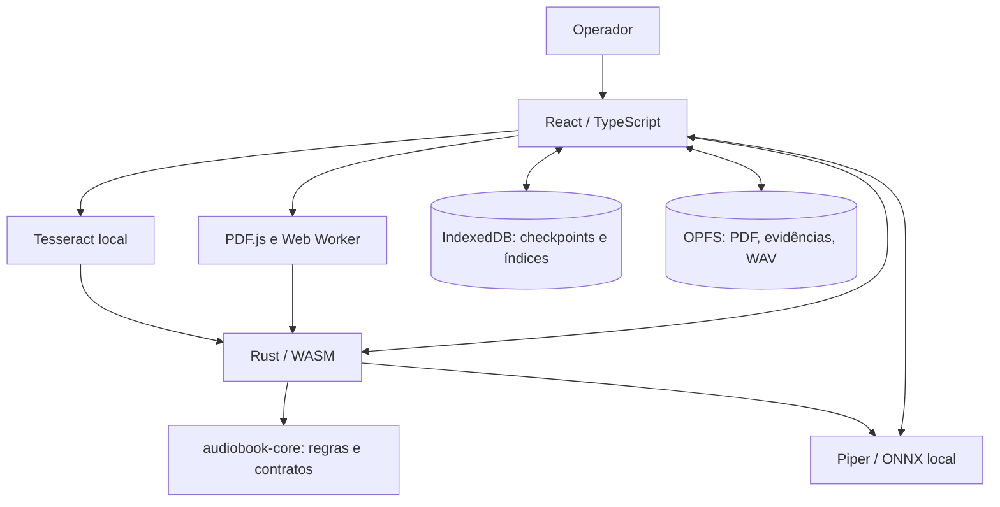

# Arquitetura — Audiobook Studio

> Baseline técnico: `main` em 08/10/2026. Este documento descreve fronteiras verificáveis do código atual; não é uma especificação de recursos futuros.

## Contexto e critérios

O objetivo do Audiobook Studio é converter um **documento fornecido pelo usuário** em áudio **com rastreabilidade do texto utilizado**. A confiança da extração é uma condição de passagem: texto OCR, scripts reescritos e relatórios automáticos não são aceitos como verdade apenas por existirem.

Decisões que orientam o projeto:

1. **Local-first:** arquivos, checkpoints, revisões e WAVs ficam no dispositivo (IndexedDB e OPFS). Não há microserviço obrigatório nem upload automático do PDF para uma API própria.
2. **Domínio canônico em Rust:** invariantes, modelos, hashes e decisões de elegibilidade são validados no `crates/core`. O WASM expõe o core; TypeScript não duplica decisões canônicas.
3. **Fontes não confiáveis:** texto extraído nunca se torna instrução executável. OCR é evidência candidata até haver uma decisão explícita.
4. **Falha visível:** corrupções, divergências de fonte, perdas de capacidade e checkpoints incompatíveis interrompem a passagem; não há reconstrução silenciosa de aprovação.
5. **Isolamento por responsabilidade:** Workspaces de UI e adapters coordenam operações; PDF.js, Tesseract, Piper, IndexedDB, OPFS e Web Locks ficam fora do domínio.

## Visão de contêineres

O diagrama representa **responsabilidades**, não garante que toda operação opere sem rede desde o primeiro acesso: aplicação, runtime e modelo de voz podem precisar ser obtidos inicialmente.

## Ownership: onde cada mudança deve entrar

| Camada | Local | Responsabilidade e regra |
|---|---|---|
| Domínio | `crates/core/src` | DocumentIR v1/v2, proveniência, OCR canônico, revisão, narrativa, QA, leitura e validação de artefatos. Não depende de DOM, rede, armazenamento ou UI. |
| Ponte Rust/Web | `crates/wasm` | Exportações e serialização dos contratos Rust. Atualizar bindings e testes de paridade ao alterar uma API. |
| Modelo de fronteira | `apps/web/src/schemas` | Validação dos contratos recebidos/enviados; espelha o núcleo, não cria a regra canônica. |
| Integração | `apps/web/src/adapters` | PDF.js, OCR, TTS, quota, persistência, Web Locks e chamadas ao WASM. |
| Execução concorrente | `apps/web/src/workers` | Extração e síntese fora do caminho crítico da interface; comunicação com protocolo tipado. |
| Interface | `apps/web/src` | Projeto, Documento, Revisão, Narrativa, Áudio e Exportar. Feedback, acessibilidade e ações explícitas. |
| Operação | `scripts/`, `apps/web/scripts/`, `.github/workflows` | WASM build, staging de assets, verificação de deploy, smoke opt-in e CI. |

`App.tsx` ainda coordena várias jornadas/estados de aplicação e é um **ponto de atenção de manutenção**, não justificativa para movê-las apressadamente ao core. Extrações futuras precisam preservar sequenciamento, abort, geração ativa, URL cleanup e locks.

## Fluxos que precisam preservar invariantes

### PDF até revisão

1. Browser importa PDF dentro dos limites de tamanho e páginas; a extração é orquestrada com PDF.js e Workers.
2. O core Rust recebe o material para produzir/validar a representação canônica (DocumentIR) e sua proveniência.
3. A interface permite conferir texto original e revisar candidatos OCR locais. Fonte, região/página, recorte e decisões são ligados por hashes e referências.
4. A **composição de múltiplas aprovações OCR** existe no Rust/WASM e na persistência `canonical_ocr_batch.ts`, mas seu consumo na interface e no caminho narrativo ainda é um elo incompleto: não chamar de fluxo integrado.
5. Regiões não aprovadas e páginas com extração suspeita não ganham elegibilidade por inferência.

### Narrativa até WAV

1. Uma fonte canônica aprovada é entrada para estrutura/outline, plano, roteiro e revisão por referências.
2. QA impede passagem de conteúdo com achados críticos; a revisão humana não é autenticação de identidade nem comprovação semântica automática.
3. Uma sequência de unidades de fala validadas pelo Rust é enviada ao adapter de síntese local.
4. Piper divide a geração em partes, persiste artefatos, compõe WAV e apresenta capítulos/player/download. A primeira execução pode baixar o modelo.
5. A exportação preserva vínculos com o projeto e valida metadados/arquivos antes de reutilizar gravações.

### Persistência e retomada

- **IndexedDB** contém checkpoints, índices, versões e fila de manutenção; **OPFS** guarda bytes grandes (fonte, evidências e áudio).
- A publicação exige validação de hash/identidade e controle de concorrência (Web Locks/CAS) onde aplicável.
- Remover uma gravação é **operação explícita**: preservar referência recuperável, enfileirar exclusão e admitir retry se a remoção física falhar.
- Não prometer execução com aba fechada: a aplicação retoma estado salvo, mas o navegador pode interromper síntese e OCR em segundo plano.
- Dados permanecem no **origin local do navegador**, não em uma conta sincronizada. Limpar dados do site pode ser destrutivo.

## Trust boundaries e ameaças

| Fronteira | Risco | Mitigação atual / pendência |
|---|---|---|
| PDF externo → extração | Documento malformado, camada de texto privada ou truncada | Limites, leitura como dado, marcação de texto suspeito. Faltam fuzzing e corpus adversarial amplo. |
| OCR → texto elegível | Substituir número/código por token visualmente similar | Revisão explícita, comparação, hashes e bloqueio de sugestões automáticas. Faltam goldens amplos e falso-positivo mensurado. |
| Roteiro → narrativa | Texto reescrito altera significado | Referências à fonte, revisão de claims e QA estrutural. A qualidade semântica exige operador e corpus revisado. |
| Browser → armazenamento | Corrupção, queda, corrida ou quota | Manifests, checksums, checkpoints, CAS e recuperação; checksum **não** é defesa contra código malicioso rodando no mesmo origin. |
| Rede e modelo local | Dependência externa inicial e disponibilidade do dispositivo | Assets de OCR/ONNX no build; voz Piper baixada quando necessário. Verificar comportamento de rede em browsers-alvo. |

## Critérios de qualidade e limites declarados

- Rust: `cargo fmt --all -- --check`, `cargo test --workspace --locked`, `cargo clippy --workspace --all-targets -- -D warnings`.
- Web: `npm ci`, `npm run wasm:build` ao alterar Rust/WASM, `npm run test:standard`, `npm audit --audit-level=high`.
- Browser: smokes opt-in de OCR/áudio/shell, com artefatos, viewport, recuperação e requisitos externos documentados; não representam auditoria WCAG ou escuta humana.
- CI: `.github/workflows/quality.yml` verifica Rust, Web e bindings gerados. Scripts de documentação validam referências locais dos documentos principais.

A cobertura funcional é **parcial**: OCR multi-revisão integrado à narrativa, extração confiável de tabelas/figuras/código, matriz Android real, benchmarks de fidelidade, long-running/background e avaliação semântica extensiva ainda são pendências. Veja [GAP_ANALYSIS](GAP_ANALYSIS.md), [SECURITY](SECURITY.md), [PERSISTENCE](PERSISTENCE.md) e os [ADRs](adr/).

## Evolução sem recomeçar

1. Provar, por teste Rust/WASM e smoke em browser, seleção **explícita** da composição OCR histórica e seu vínculo ao texto canônico da narrativa; não promover revisões silenciosamente.
2. Ampliar corpus e goldens públicos/privados revisados com amostras de prosa, código, tabelas e digitalizados; medir CER/WER e erros críticos.
3. Medir latência, consumo de memória, duração de áudio e interrupção/retomada em Android real.
4. Só depois avaliar melhorias de planner/modelo, desempenho e experiência sem afrouxar invariantes.

Qualquer mudança de fronteira canônica exige novo ADR; mudanças pequenas de docs/CI e apresentação não alteram o modelo de domínio.
